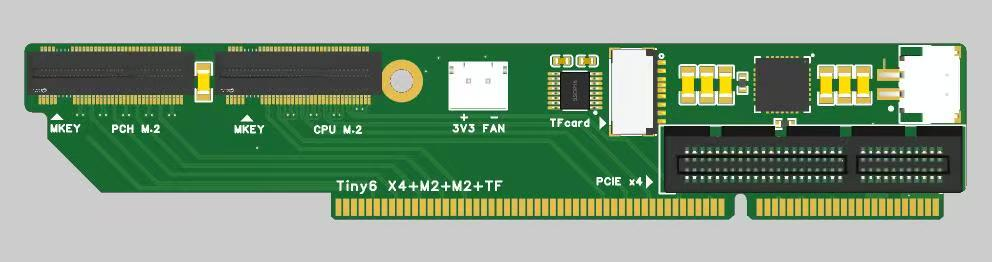
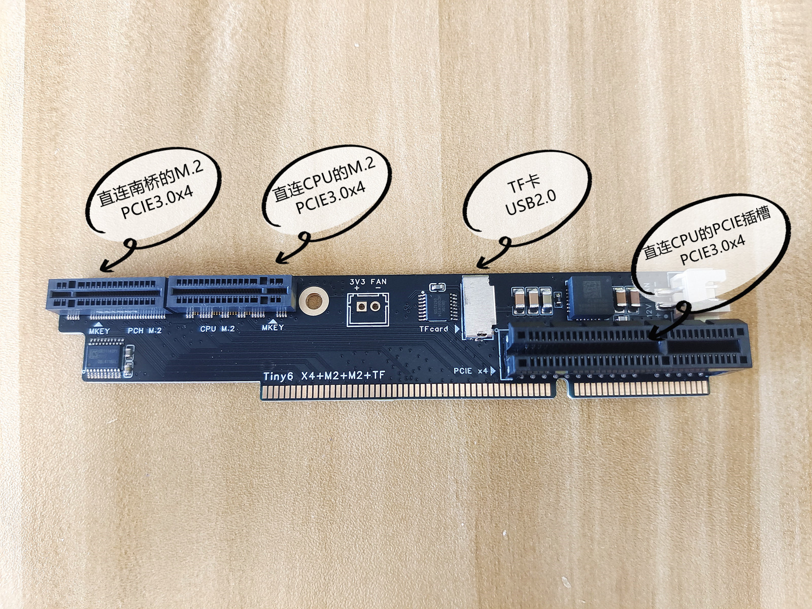
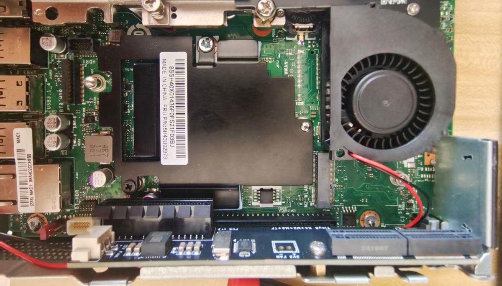
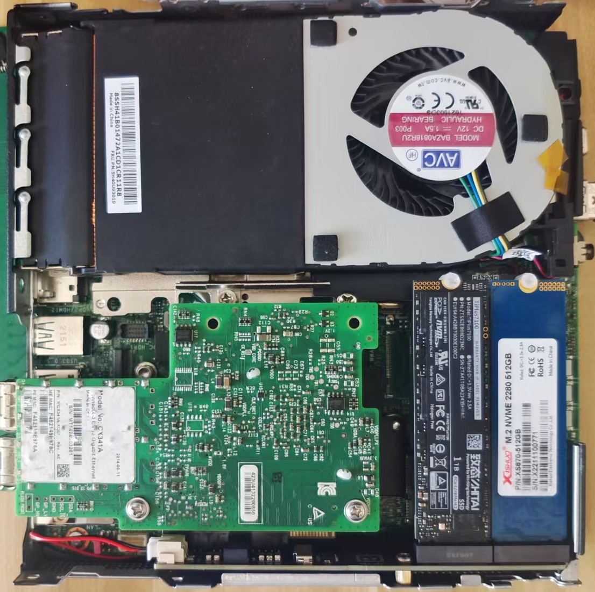
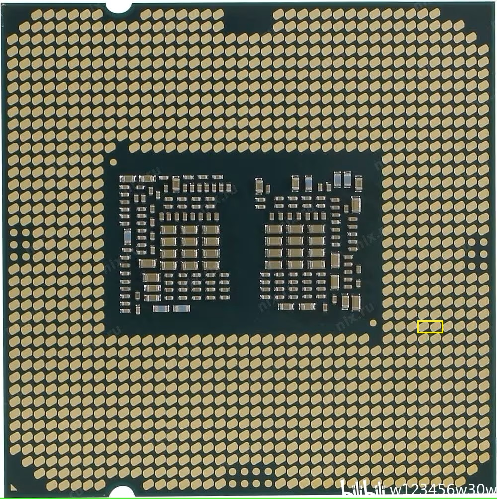

# Tiny6-P340-pcie-bifurcation-expansion-card
Lenovo Tiny6 P340 PCIE Bifurcation Expansion Card

** 目前已经测试完成，已在淘宝销售 **

English explanatory document: [README_EN.md](README_EN.md)

https://h5.m.taobao.com/awp/core/detail.htm?id=901219002736

如果是海外用户，无法直接在淘宝购买，可以使用代购平台：

https://www.superbuy.com/

其他教程信息请看B站链接： https://b23.tv/Vhjv9B8

## PCIE拆分卡图片

拆分卡接口资源介绍，支持： 

    1个PCIE插槽(PCIE3.0 x4)

    2个M.2插槽(nvme PCIE3.0 x4)

    1个TF卡插槽(USB2.0)

    1个风扇插座(12V XH2.54)

主板安装后图片：

## P340改PCIE拆分方法：

有2种方式，一种是短接CPU触点，另一种是补上主板上面的短接电阻。最终目的是一样的，将对应的触点短接起来。

### 方式一： 短接CPU触点

自备 导电银漆 or 导电胶带

如下图，将黄色框中的2个触点短接起来即可。

### 方式二： 补上主板上面的配置电阻

** 不建议这种方式，短接CPU触点更简单方便 **

自备  0805封装 0R电阻 1颗

如下图，将黄色框中的2个触点，短接到一起。 (0R电阻、一坨锡、飞线、导电银漆 都行，反正短接到一起就可以)

如下图补上电阻。

如果有万用表，则焊接完成后，使用通断档，测试下图中2个黄色箭头所指位置，是否连通。

## 最后安装上拆分卡

如遇到拆分卡  X4接口或 中间M2硬盘接口无法使用。 那就是没有短接好，需要重新检查。

