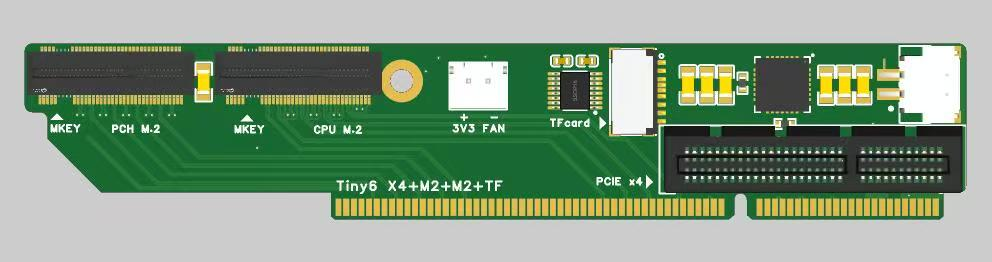
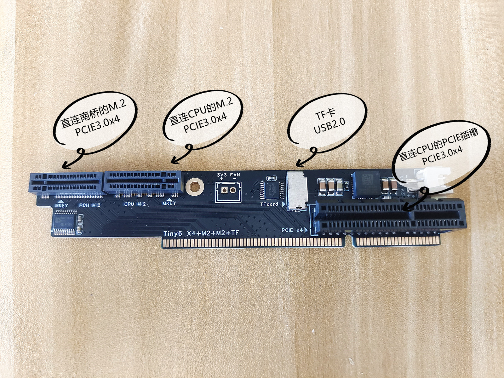
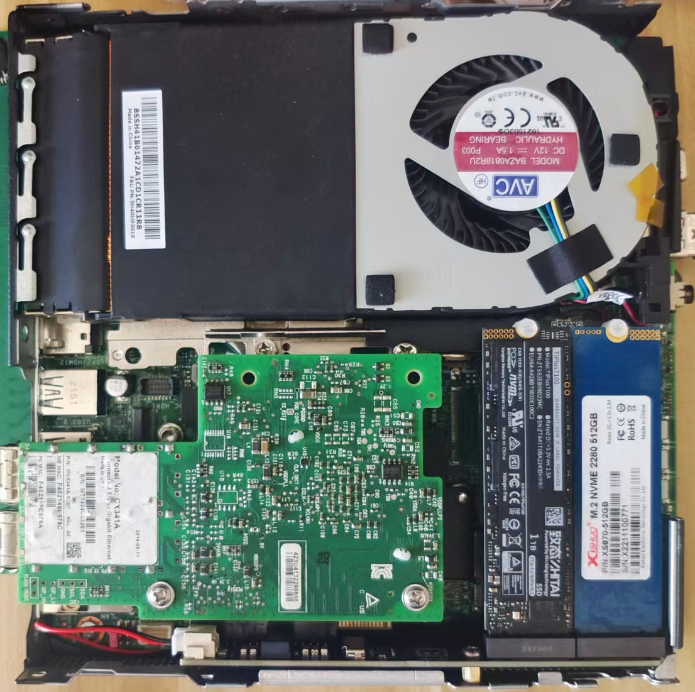
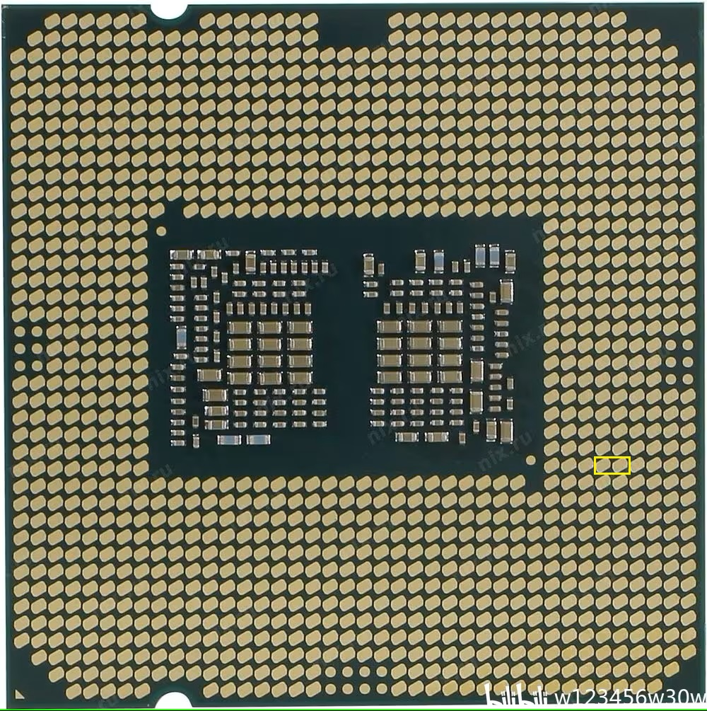
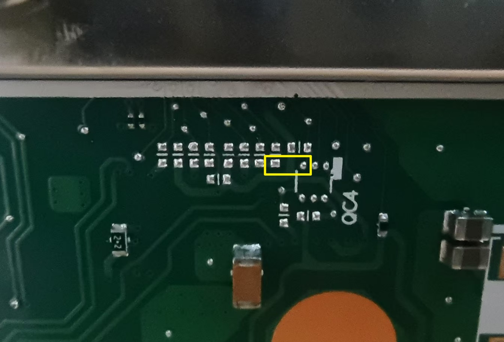
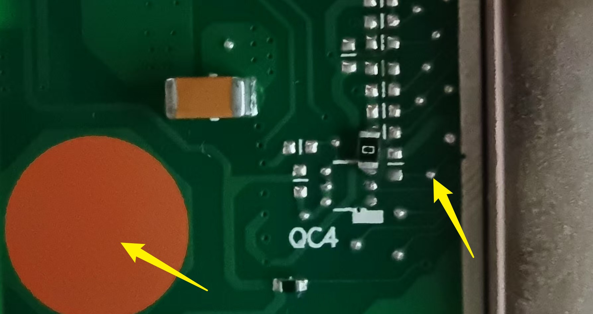

# Tiny6-P340-pcie-bifurcation-expansion-card
Lenovo Tiny6 P340 PCIE Bifurcation Expansion Card

** At present, the testing has been completed and it has been sold on Taobao **

https://h5.m.taobao.com/awp/core/detail.htm?id=901219002736

If you are an overseas user and cannot purchase directly on Taobao, you can use a purchasing platform：

https://www.superbuy.com/

For other tutorial information, please refer to the Bilibili link： https://b23.tv/Vhjv9B8

## PCIE Bifurcation card image

Introduction to Bifurcation Card Interface Resources, Supporting： 

	1 PCIE slot (PCIE3.0 x4)
	2 M.2 slots (nvme PCIE3.0 x4)
	1 TF card slot (USB 2.0)
	1 FAN socket (12V XH2.54)

Picture of the motherboard after installation：

## P340 Change PCIE Bifurcation method：

There are two ways, one is to short-circuit the CPU contacts, and the other is to add a short-circuit resistor on the motherboard. The ultimate goal is the same, to short-circuit the corresponding contacts.

### Method 1: Short circuit CPU contacts

Bring your own conductive silver paint or conductive tape.

As shown in the figure below, short circuit the two contacts in the yellow box.

### Method 2: Add the configuration resistor on the motherboard

** This method is not recommended. Short circuiting the CPU contacts is simpler and more convenient **

Self provided 0805 packaged 0R resistor 1 piece

As shown in the figure below, short-circuit the two contacts in the yellow box together. (0R resistor, a piece of tin, flying wire, conductive silver paint are all acceptable, they can be short circuited together anyway)

Add resistors as shown in the following figure。

If there is a multimeter, after welding is completed, use the on/off gear to test whether the positions indicated by the two yellow arrows in the figure are connected.

## Finally, install the Bifurcation card

If the X4 interface of the Bifurcation card or the M2 hard drive interface in the middle cannot be used. That's because the short circuit was not properly connected and needs to be rechecked.

